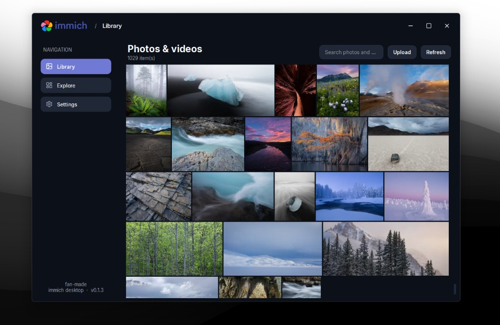

<p align="center">
  
</p>

<h1 align="center">immich desktop</h1>

<p align="center">
  <strong>Unofficial Qt desktop client for Immich</strong><br>
  Browse, search, upload, download, and stream your self-hosted photo library.
</p>

<p align="center">
  <a href="https://github.com/hdmain/immich-desktop/releases/latest"></a>
  <a href="https://github.com/hdmain/immich-desktop/stargazers"></a>
  <a href="https://github.com/hdmain/immich-desktop/network/members"></a>
  <a href="https://github.com/hdmain/immich-desktop/issues"></a>
  <a href="https://github.com/hdmain/immich-desktop/releases"></a>
  <a href="https://snapcraft.io/immich-desktop"></a>
  <a href="LICENSE.txt"></a>
</p>

> **Unofficial project.** Fan-made desktop client — not affiliated with, maintained by, or endorsed by the official Immich project. Immich and its logo belong to their respective owners.

## Showcase



## Features

- **Library** — Immich-style timeline with compact rows and grouped days
- **Explore** — people, places, and discovery views
- **Search** — find photos and videos across your library
- **Upload & download** — send media to the server or save it locally
- **Video streaming** — built-in player with seek, volume, and buffering
- **Offline mode** — keep browsing with a local thumbnail/disk cache
- **Themes** — light, dark, and custom palettes
- **Desktop extras** — system tray, close-to-tray, autostart, single-instance

## Install

### Linux (Snap)

```bash
sudo snap install immich-desktop
```

<p align="center">
  <a href="https://snapcraft.io/immich-desktop">
    
  </a>
</p>

<iframe src="https://snapcraft.io/immich-desktop/embedded?button=black" frameborder="0" width="100%" height="380px" style="border: 1px solid #CCC; border-radius: 2px;"></iframe>

> GitHub’s README viewer strips iframes; the embed works on sites that allow HTML. On GitHub, use the badge above or open [snapcraft.io/immich-desktop](https://snapcraft.io/immich-desktop).

### Other packages

Grab Windows (`.exe` / `.msi`), Linux `.deb`, or AppImage from the
[latest release](https://github.com/hdmain/immich-desktop/releases/latest).

## How to run

1. Install Immich Desktop from Snap or a [GitHub release](https://github.com/hdmain/immich-desktop/releases/latest).
2. Open the app and go to **Settings → Immich Server**.
3. Enter your Immich server URL and an API key with at least `user.read`, `asset.read`, and `asset.view`.
4. Test the connection, save, then browse **Library** or **Explore**.

```bash
# Snap
immich-desktop

# AppImage
chmod +x immich-desktop-x86_64.AppImage
./immich-desktop-x86_64.AppImage
```

## Roadmap

| Status | Item |
| --- | --- |
| Done | Library timeline, search, upload / download |
| Done | Explore (people & places) |
| Done | Video streaming player |
| Done | Offline / disk cache |
| Done | Themes, tray, autostart, single-instance |
| Done | Snap Store packaging |
| Next | Album management & sharing actions |
| Next | Faster sync and smarter offline queue |
| Next | Richer Explore filters and map polish |
| Later | Mobile-adjacent workflows & multi-account |
| Later | Deeper Immich feature parity (faces, memories, etc.) |

## Project layout

- `src/core` — settings, Immich client, updates, tray helpers
- `src/ui` — shell, pages, and widgets
- `resources` — icons, fonts, desktop metadata
- `snap` — Snap packaging

## License

MIT — see [LICENSE.txt](LICENSE.txt).
