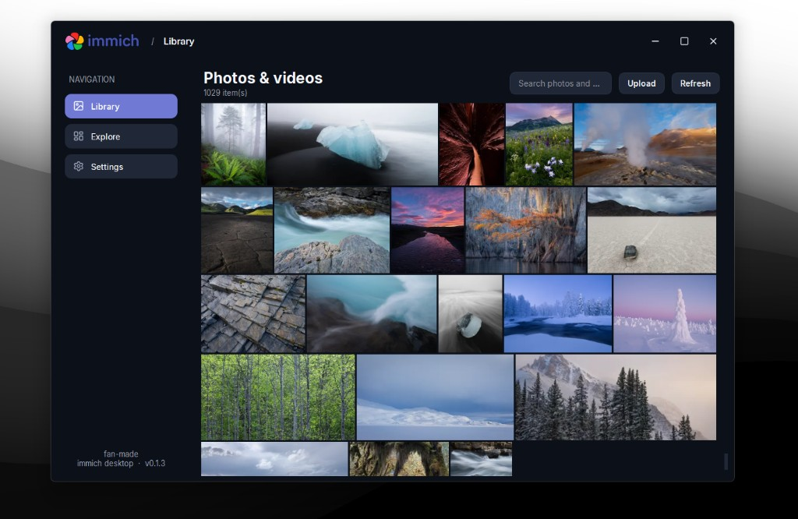

<p align="center">
  
</p>

<h1 align="center">immich desktop</h1>

<p align="center">
  <strong>Unofficial Qt desktop client for Immich</strong><br>
  Browse, search, upload, download, and stream your self-hosted photo library.
</p>

<p align="center">
  <a href="https://github.com/hdmain/immich-desktop/releases/latest"></a>
  <a href="https://github.com/hdmain/immich-desktop/stargazers"></a>
  <a href="https://github.com/hdmain/immich-desktop/network/members"></a>
  <a href="https://github.com/hdmain/immich-desktop/issues"></a>
  <a href="https://github.com/hdmain/immich-desktop/releases"></a>
  <a href="https://snapcraft.io/immich-desktop"></a>
  <a href="LICENSE.txt"></a>
</p>

> **Unofficial project.** Fan-made desktop client , not affiliated with, maintained by, or endorsed by the official Immich project. Immich is a trademark of its respective owners. This app uses its own branding.

## Showcase



## Features

- **Library** - Immich-style timeline with compact rows and grouped days
- **Explore** - people, places, and recent media; open a person or place as an in-app Library-style gallery
- **Search** - find photos and videos across your library
- **Folder Sync** - watch a local folder and auto-upload new photos/videos to Immich (Windows, macOS, Linux)
  - Optional **local-network only** mode: upload only when your Immich Local URL is reachable
  - Unsynced files show in Library immediately with an **unsaved** badge (saving / error icons while uploading)
- **Upload & download** - drag-and-drop, paste, send media to the server, or save it locally
- **Video streaming** - built-in player with seek, volume, buffering, and muted hover preview
- **Offline mode** - keep browsing with a local thumbnail/disk cache; uploads queue until online
- **Themes** - light, dark, and custom palettes
- **Desktop extras** - system tray, close-to-tray, autostart, single-instance

## Install

### Linux (Snap)

```bash
sudo snap install immich-desktop
```

<p align="center">
  <a href="https://snapcraft.io/immich-desktop">
    
  </a>
</p>

### Other packages

Grab Windows (`.exe` / `.msi`), Linux `.deb`, or AppImage (`x86_64` / `aarch64`)
from the [latest release](https://github.com/hdmain/immich-desktop/releases/latest).
Snap Store ships `amd64` and `arm64`.

## How to run

1. Install Immich Desktop from Snap or a [GitHub release](https://github.com/hdmain/immich-desktop/releases/latest).
2. Open the app and go to **Settings → Immich Server**.
3. Enter your Immich server URL and an API key with permissions such as `user.read`, `asset.read`, `asset.view`, `asset.upload`, `asset.download`, `asset.delete`, and `person.read`. Optionally set a **Local URL** for LAN use.
4. Test the connection, save, then browse **Library** or **Explore**.
5. (Optional) Open **Settings → Folder Sync**, choose a folder, enable watching, and turn on **Upload only when Immich is available on the local network** if you only want uploads over LAN. Drop photos or videos into that folder; they appear in Library with sync status badges and upload when allowed.

```bash
# Snap
immich-desktop

# AppImage (x86_64 or aarch64)
chmod +x immich-desktop-x86_64.AppImage   # or immich-desktop-aarch64.AppImage
./immich-desktop-x86_64.AppImage
```

## Roadmap

Plans can shift , track progress and ideas in
[Issues](https://github.com/hdmain/immich-desktop/issues).

### Shipped

- Library timeline with search, preview, trash, upload & download
- Explore: people and places as in-page galleries (Library-style person/place views)
- Folder Sync: watched local folder, LAN-only upload option, unsaved/saving/error badges in Library
- Video streaming player and hover preview
- Offline browsing via local disk cache + queued uploads when offline
- Themes (light / dark / custom), system tray, autostart, single-instance
- Packaging: Windows installers, `.deb`, AppImage, Snap Store (`amd64` + `arm64`)

### Near term

- **Albums** - browse, create, add/remove assets, cover photos
- **Bulk actions** - multi-select favorite, archive, download, trash, album assign
- **Upload reliability** - pause/resume, per-file progress, clearer failure recovery
- **Explore polish** - map improvements, people naming/merge hooks, better empty states
- **Keyboard & UX** - shortcuts, smoother timeline scrolling, denser grid options

### Next

- **Sharing** - album links, partner sharing, copy public URLs from the desktop
- **Memories & faces** - Immich memories feed and richer face/person management
- **Smart library tools** - duplicates, archive views, advanced filters (type, camera, date)
- **Notifications** - tray alerts for finished uploads and available updates
- **Sync health** - richer Folder Sync history, last sync time, cache size controls

### Later

- Multi-account / multi-server profiles
- Full-resolution offline packs for selected albums
- External editor / “open with” workflows
- Wider Immich API parity as the server evolves
- Broader packaging (Flatpak) as demand appears

## Looking for collaborators

I'm looking for people who want to co-build this project , and other projects too (mine or yours). Whether you want to contribute to **immich desktop**, start something new together, or get help on your own repo, reach out and let's figure out what to build.

**Contact - Discord:** `diegosanche3` · **GitHub:** [github.com/hdmain/immich-desktop](https://github.com/hdmain/immich-desktop) · **Issues:** [github.com/hdmain/immich-desktop/issues](https://github.com/hdmain/immich-desktop/issues)

Ways to help right now: bug fixes, UX polish, Immich API coverage (albums, sharing, memories), packaging (Flatpak/Snap), and testing on different distros/GPUs. No pressure on scope , small PRs and ideas are welcome too. See `Settings → About` in the app for the full tech stack and links.

## Project layout

- `src/core` - settings, Immich client, updates, tray helpers
- `src/ui` - shell, pages, and widgets
- `resources` - icons, fonts, desktop metadata
- `snap` - Snap packaging

## License

MIT - see [LICENSE.txt](LICENSE.txt).
